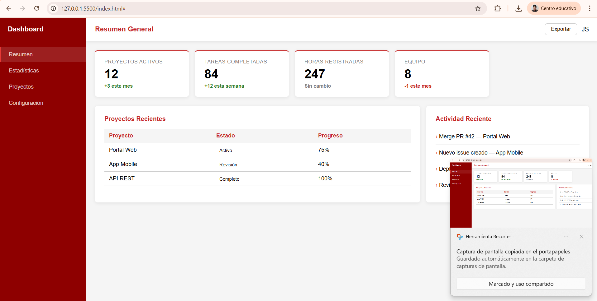
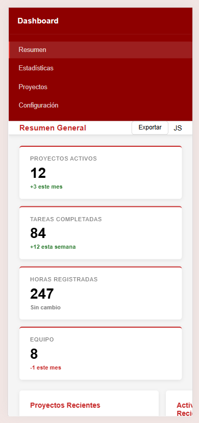
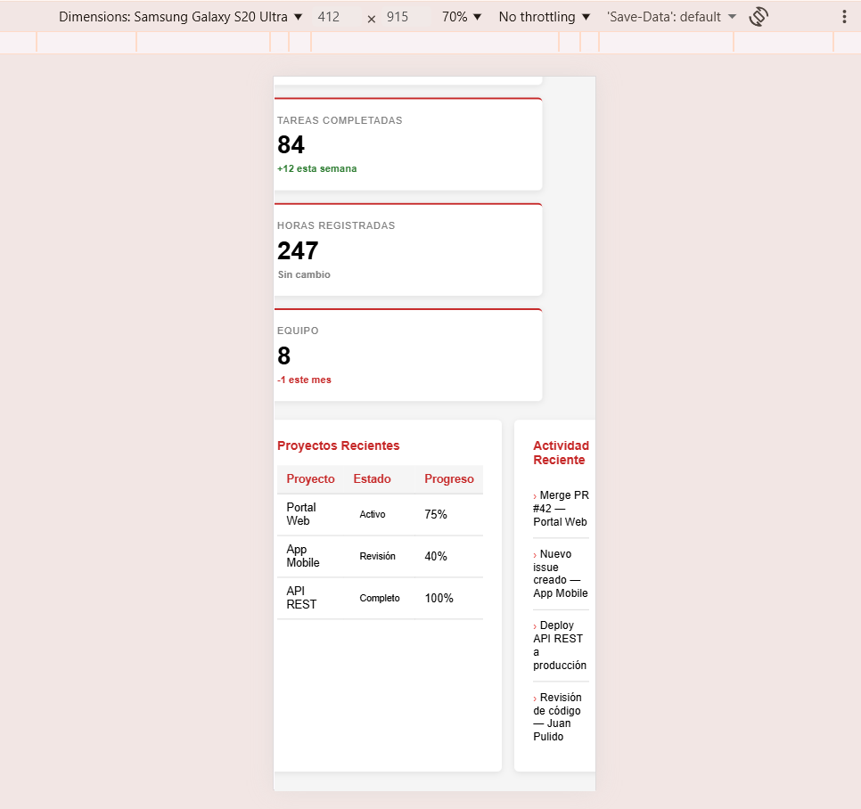

# pulido-post2-u3
Laboratorio: Dashboard con Grid y Flexbox

## 👨‍🎓 Estudiante
Juan Pulido  
Ingeniería de Sistemas  

---

Este proyecto consiste en el desarrollo de un dashboard web responsivo utilizando HTML5 y CSS3, aplicando los modelos de layout modernos como CSS Grid para la estructura principal y Flexbox para los componentes internos.

El dashboard incluye:
- Sidebar de navegación
- Barra superior (topbar)
- Tarjetas de estadísticas responsivas
- Tabla de proyectos
- Panel de actividad reciente

---

## 🚀 Tecnologías utilizadas

- HTML5
- CSS3 (Grid y Flexbox)
- Visual Studio Code
- Live Server

---

## ▶️ Instrucciones de ejecución

1. Clonar el repositorio:
   git clone https://github.com/tu-usuario/apellido-post2-u3.git

2. Abrir el proyecto en Visual Studio Code

3. Ejecutar el archivo `index.html` con Live Server  
   o abrirlo directamente en el navegador

## 🖼️ Capturas de pantalla

### 💻 Vista en escritorio 

### 📱 Vista en móvil 

